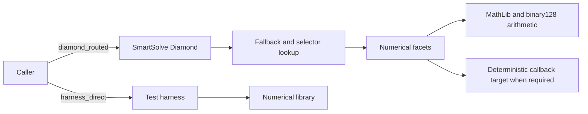

# SmartSolve

SmartSolve is an experimental Solidity numerical-computation and benchmarking
framework for the EVM. It combines IEEE-754 binary128 (`bytes16`) arithmetic
with a Diamond Standard (EIP-2535) deployment so numerical kernels can be
tested both in isolation and through the production proxy path.

It is intended to make a difficult engineering question inspectable: which
small, deterministic numerical workloads are correct, reproducible, and
feasible under an explicitly defined EVM environment?

> **Status:** research and engineering prototype. The repository includes a
> full SmartSolve Diamond deployer, post-deploy verification, bounded tests,
> opt-in feasibility experiments, and structured benchmark exports. It is not
> an audited mainnet product.

## At a glance

| Area | Included capabilities |
| --- | --- |
| Numerical kernels | Integration, differentiation, ODE stepping, polynomial operations, root finding, matrix operations, linear solvers, and steepest descent. |
| Arithmetic | Shared linked `MathLib` wrapper around ABDK binary128 operations, with narrowly documented hot-path experiments. |
| Production route | A Diamond with numerical facets, selector routing, proxy-held numeric configuration, and deployment/verification helpers. |
| Evidence | Accuracy tests, gas estimates, deployment gas, bytecode budgets, equal-accuracy comparisons, and opt-in scalability/OOG experiments. |

## Architecture



The Diamond route is the deployable-system path. Harnesses remain useful for
isolating algorithm and arithmetic costs, but are deliberately reported as a
separate execution model. See [BENCHMARKS.md](BENCHMARKS.md) for the exact
comparison and current measurements.

## Quickstart

```sh
npm install
npm test
npm run test:bytecode
npx tsc --noEmit
```

`npm test` is the practical bounded suite for local development and CI. It
does not run the expensive feasibility corpora. Common next commands are:

| Goal | Command |
| --- | --- |
| Run all tests, including non-heavy suites | `npm run test:full` |
| Run opt-in linear-solver feasibility tests | `npm run test:heavy` |
| Run opt-in MatrixMaster feasibility tests | `npm run test:heavy:matrix` |
| Export representative benchmark JSON | `npm run benchmark:export:representative` |
| Compare equal-accuracy configurations through the Diamond | `npm run benchmark:equal-accuracy:diamond` |
| Run the fixed-point Horner baseline | `npm run benchmark:baseline:polynomial` |
| Deploy and verify on ephemeral local Hardhat | `npm run deploy:local` |

Detailed commands, outputs, and the meaning of these measurements are in
[BENCHMARKS.md](BENCHMARKS.md). Local and Sepolia deployment procedures are in
[DEPLOYMENT.md](DEPLOYMENT.md).

## What this is / what this is not

**SmartSolve is:**

- an experimental Solidity numerical-computation framework;
- a benchmark and feasibility-study framework for numerical EVM kernels; and
- a Diamond-based production-path demonstrator with reproducible deployment
  and verification tooling.

**SmartSolve is not:**

- an audited production DeFi math library;
- a universal replacement for off-chain numerical computation;
- evidence that every algorithm is economical for Ethereum mainnet use; or
- a guarantee that every accuracy suite establishes empirical binary128-level
  accuracy for every input family.

## Practical uses

- **Bounded on-chain verification and demonstrations.** Exercise small,
  deterministic numerical checks where a verifiable result is more valuable
  than inexpensive throughput.
- **Solidity precision and gas experiments.** Compare arithmetic choices,
  accumulation strategies, callback costs, and proxy-routing overhead for a
  specific numerical kernel.
- **Feasibility prototypes.** Evaluate small oracle, risk-model, or
  research/grant workloads whose bounds, gas budget, and precision goals are
  stated explicitly before deployment.

These are suitable starting points for specialised DeFi, oracle, or risk-model
experiments only when their problem sizes are small and their full
application-level security review is separate from this repository.

## Current engineering limits

- Binary128 computation and callback-driven algorithms are gas-intensive.
  Reported callback benchmarks include target `STATICCALL` gas rather than
  attempting to subtract it.
- `MatrixMasterFacet` is currently 22,425 runtime bytes, leaving 2,151 bytes
  of EIP-170 headroom. The project bytecode test enforces a tighter 23,000-byte
  budget.
- Large MatrixMaster and linear-solver workloads are preserved as opt-in
  feasibility experiments. Explicit out-of-gas outcomes are reported instead
  of being presented as normal correctness failures.
- The Diamond owner controls upgrades and numeric configuration. Treat the
  owner choice and key-management process as deployment-critical.

## Documentation map

- [BENCHMARKS.md](BENCHMARKS.md) — commands, execution models, result exports,
  representative gas/footprint figures, and known feasibility boundaries.
- [DEPLOYMENT.md](DEPLOYMENT.md) — local and Sepolia deployment, verification,
  deployment artifacts, and operational cautions.

## License

Distributed under the MIT License.

```text
Copyright (c) 2026 SMART-SOLVE

Permission is hereby granted, free of charge, to any person obtaining a copy
of this software and associated documentation files (the "Software"), to deal
in the Software without restriction, including without limitation the rights
to use, copy, modify, merge, publish, distribute, sublicense, and/or sell
copies of the Software, and to permit persons to whom the Software is
furnished to do so, subject to the following conditions:

The above copyright notice and this permission notice shall be included in all
copies or substantial portions of the Software.
```
